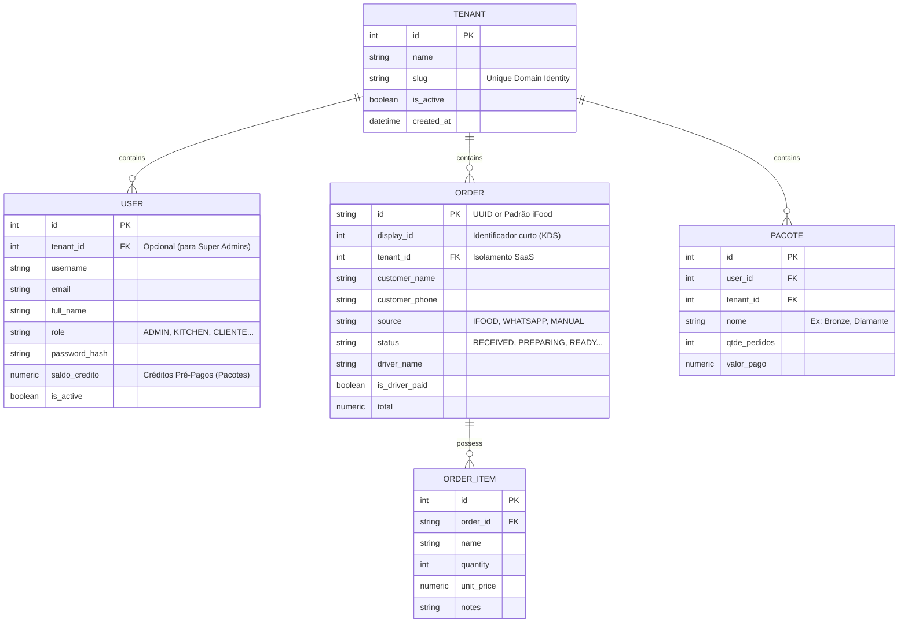

# PostgreSQL Schema & Database Documentation

Este documento reflete a estrutura de banco de dados do sistema, arquitetada e rodada nativamente em cima da Engine **PostgreSQL** através das migrações do **Alembic/SQLAlchemy**.

## 1. Diagrama de Entidade-Relacionamento (ERD)

Abaixo, apresentamos o fluxo de modelo relacional, evidenciando principalmente a injeção do paradigma **Multi-Tenant (SaaS)** que segmenta os dados de franquias separadas.



## 2. Abordagem Row-Level-Security (Tenant Isolation)

Para garantir que o *Estabelecimento A* nunca veja ou edite os Pedidos (`orders`) ou Funcionários (`users`) do *Estabelecimento B*, aplicamos "Row-Level-Security Lógica" nos novos **Repositórios**.

Toda *query* disparada pelos Repositórios (`app/repositories/order.py`, etc) recebe, ao instanciar ou na execução contextual, um `tenant_id`.
O fragmento SQLAlchemy abaixo ilustra essa trava inquebrável por código:

```python
query = select(Order).options(selectinload(Order.items))

# RLS Lógico e Segregação B2B Clássico
if tenant_id is not None:
    query = query.where(Order.tenant_id == tenant_id)
```
Dessa forma, é impossível o serviço de Pedidos acidentalmente vazar dados de outro *slug*.

## 3. Tipagem Específica do PostgreSQL

Diferente do SQLite legado local que simulava booleanos usando numéricos, a migração para **Plataforma Postgres** garante os seguintes comportamentos otimizados no banco:

1. **Numeric**: Os campos pre-pagos do `PACOTE` e valores contábeis (`order.total`, `user.saldo_credito`) mapeiam para `NUMERIC` com precisão dupla, invalidando erros de ponto-flutuante comuns.
2. **Booleanos Reais**: Os Status de pagamentos (`is_driver_paid`) usam blocos de bit Postgres reais com default `false` blindado contra `null` injection.
3. **Foreign Keys Enforcement**: Deleção de um `Order` fará *Cascade Delete* dos `OrderItems` automaticamente sob validação da Engine sem trafegar I/O pesado de aplicação, otimizando o delete para 0.1ms.
4. **Strings Uniques**: Índices nativos criados sobre as colunas `tenant.slug` e `user.username` previnem race constraints na inserção e diminuem tempo rotineiro do Join de Login e Autorização (O(1) Search via Hashing).
